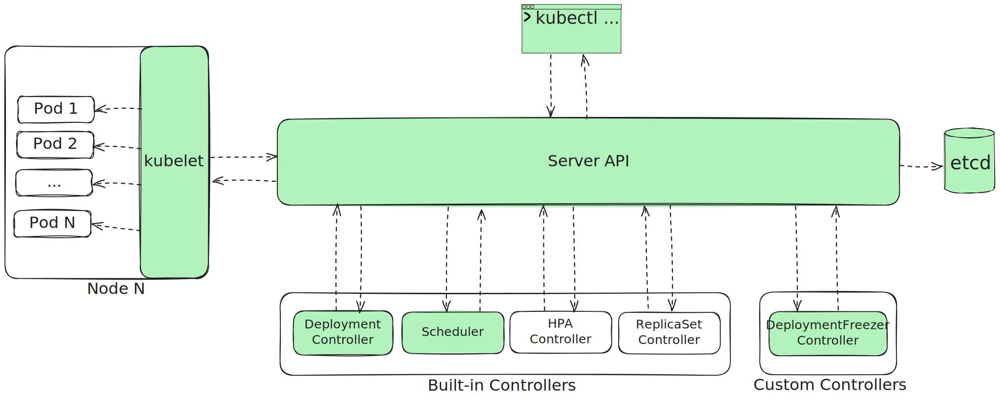
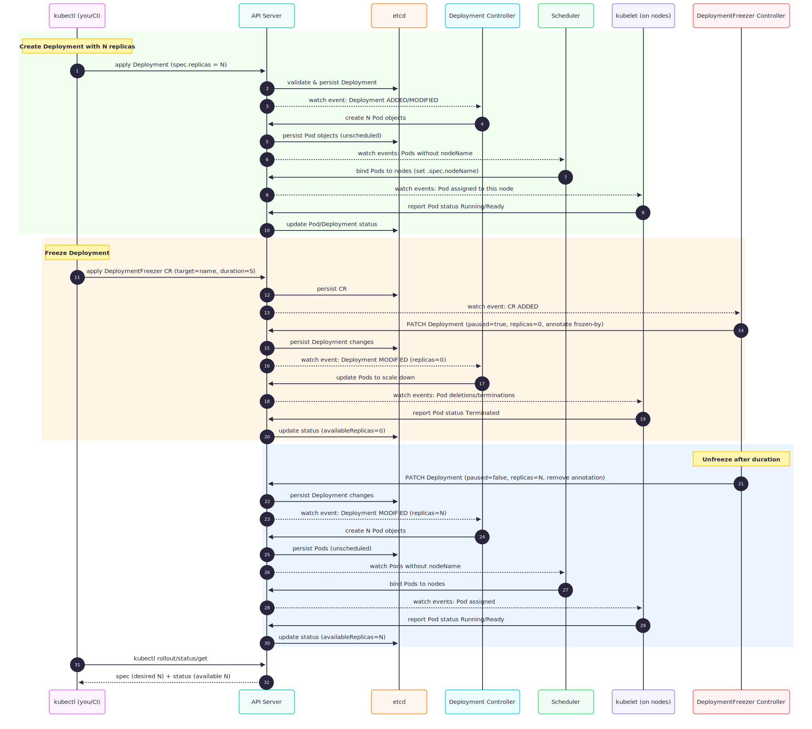

# Overview (big picture)

High-level overview of how it should work.

---

## 1. Components diagram
A static view of the main Kubernetes actors and how they interact.

---

## 2. Sequence diagram
A simple “happy path” scenario:  
*Create a Deployment with N replicas → Freeze Deployment → Unfreeze Deployment after some time.*

> ⚠️ For simplicity, this diagram omits ReplicaSets and HPAs.

---