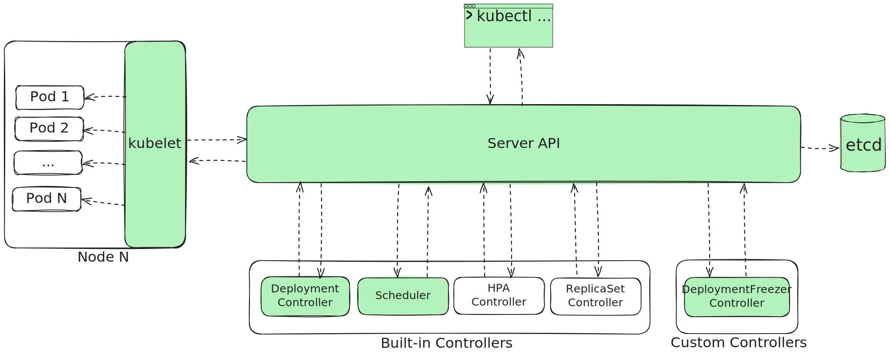
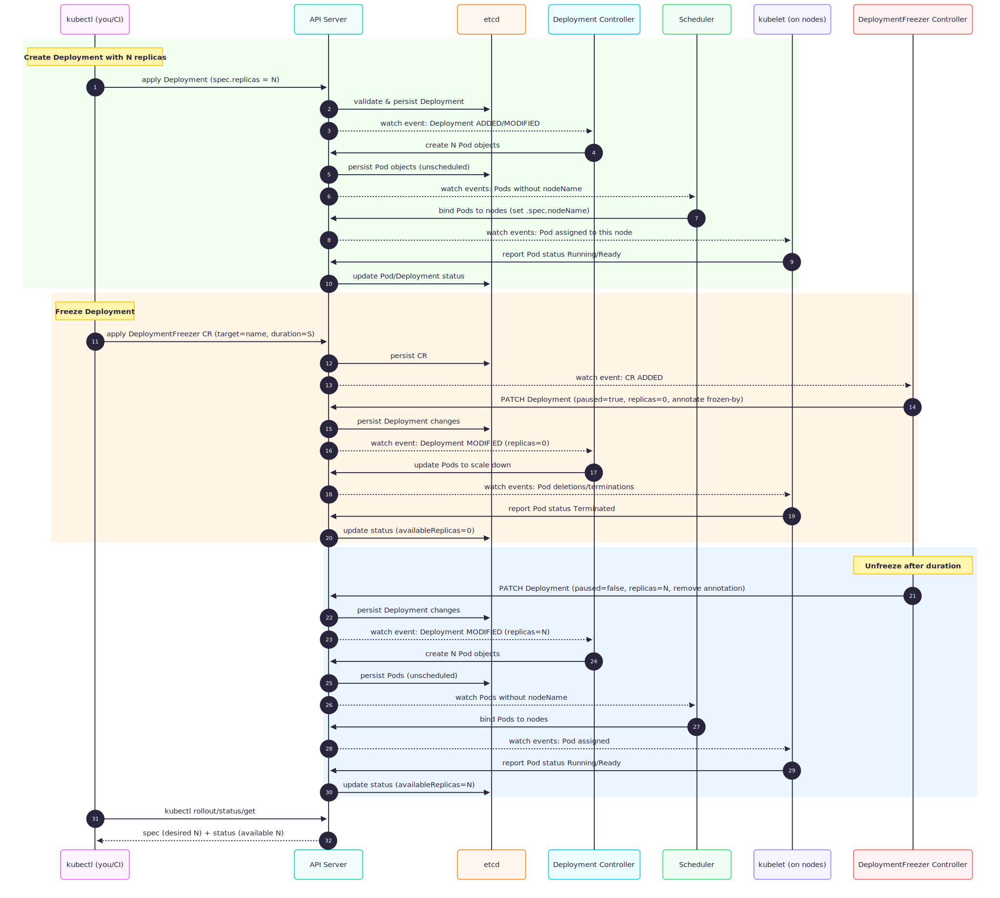

# 🚀 Quickstart

### Prerequisites

- [Go](https://go.dev/dl/) **≥ 1.24**
- [Docker](https://docs.docker.com/get-docker/)
- [kubectl](https://kubernetes.io/docs/tasks/tools/)
- [kind](https://kind.sigs.k8s.io/docs/user/quick-start/) (for local clusters)
- [make](https://www.gnu.org/software/make/)

---

### Step 1 — Create a test cluster & install CRD

```bash
# Ensure no leftovers from a previous run
kind delete cluster --name df || true

kind create cluster --name df
make install    # applies the DeploymentFreezer CRD
```


### Step 2 — Run the controller
```bash
make run
```

### Step 3 — Deploy a sample workload & freezer CR
```bash
# Clean up from previous runs (safe if first run)
kubectl delete -f examples/deploymentfreezer-freeze-10s.yaml --ignore-not-found
kubectl delete -f examples/deployment.yaml --ignore-not-found

kubectl apply -f examples/deployment.yaml
kubectl apply -f examples/deploymentfreezer-freeze-10s.yaml
```

### Step 4 — Verify behavior
```bash
# Immediately after applying: Deployment should be frozen (scaled to 0)
kubectl get deploymentfreezers
kubectl describe deploymentfreezer freeze-web
kubectl get deploy web -o yaml | grep '.spec.replicas'

# Wait ~15 seconds for automatic unfreeze
sleep 15

# After 15 seconds: replicas should be restored to original value
kubectl get deploy web -o yaml | grep '.spec.replicas'
kubectl describe deploymentfreezer freeze-web
```

### Step 5 - e2e tests:
```bash
make test-e2e
```

---

# Overview (big picture)

## 1. Components diagram
A static view of the main Kubernetes actors and how they interact.



---

## 2. Sequence diagram
A simple “happy path” scenario:  
*Create a Deployment with N replicas → Freeze Deployment → Unfreeze Deployment after some time.*

> ⚠️ For simplicity, this diagram omits ReplicaSets and HPAs.



---

## 3. State machine

---

## 4. Space identification: what exactly we are doing

We are lucky that Kubernetes architecture is already defined 😁  
The core idea is **observation of CREATE / DELETE / EDIT actions** on Kubernetes objects stored in `etcd`.

### VERY SIMPLY:
- Our custom DeploymentFreezer Controller changes Kubernetes objects **via the API Server**.  
- The API Server persists these changes in `etcd`. 
- And then the Kubernetes ecosystem (built-in controllers, scheduler, kubelets) does the appropriate work to apply them in the cluster.

---

## 5. DeploymentFreezer CRD Specification

### Resource Structure

```yaml
apiVersion: freeze.dev/v1
kind: DeploymentFreezer
metadata:
  name: freeze-web
  namespace: shop
spec:
  targetRef:
    name: web          
  durationSeconds: 600 
status:
  phase: Frozen
  observedGeneration: 3
  targetRef:
    name: web
    uid: 7c3d8c1f-...  
  originalReplicas: 6
  freezeUntil: "2025-08-24T18:45:12Z"
  conditions:
    - type: Ownership
      status: "True"
      reason: "Acquired"
      message: "DFZ freeze-web owns Deployment shop/web"
      lastTransitionTime: "2025-08-24T18:00:01Z"
```

| Field                         | Type              | Description                                                                                                            |
| ----------------------------- | ----------------- | ---------------------------------------------------------------------------------------------------------------------- |
| **spec.targetRef.name**       | string            | Name of the target Deployment (must be in the same namespace as this CR).                                              |
| **spec.durationSeconds**      | integer           | Duration of the freeze in seconds. After this period, the operator will unfreeze the Deployment.                       |
| **status.phase**              | string            | High-level lifecycle summary (see [Phase Values](#phase-values)).                                                      |
| **status.observedGeneration** | integer           | Last `metadata.generation` of the CR spec observed by the operator.                                                    |
| **status.targetRef.name**     | string            | Cached name of the target Deployment.                                                                                  |
| **status.targetRef.uid**      | string            | UID of the Deployment when the freeze began (detects if the Deployment was deleted and recreated under the same name). |
| **status.originalReplicas**   | integer           | Number of replicas of the target Deployment before freezing.                                                           |
| **status.freezeUntil**        | RFC3339 timestamp | Absolute time when the Deployment should be unfrozen.                                                                  |
| **status.conditions\[]**      | array             | Fine-grained condition objects representing current state (see [Conditions](#conditions)).                             |

### Phase Values
| Value   | Meaning                                                                                     |
| ------- | ------------------------------------------------------------------------------------------- |
| Pending | CR accepted; operator has not yet acted.                                                    |
| Freezing | Deployment is being scaled down.                                                            |
| Frozen  | Deployment is fully frozen (replicas=0) until `freezeUntil`.                                |
| Unfreezing | Deployment is being restored to its original replica count.                                 |
| Completed | Freeze/unfreeze cycle finished successfully.                                                |
| Denied  | Operator refused action (e.g., Deployment already frozen, not found, or multiple freezers). |
| Aborted | Operator stopped due to ownership loss, deletion, or unrecoverable error.                   |

### Conditions
```yaml
- type: <string>             # category of fact
  status: "True|False|Unknown"
  reason: <CamelCaseString>  # short, enum-like reason
  message: <string>          # human-readable explanation
  lastTransitionTime: <RFC3339>
```

| Field        | Type              | Description                                                                                                                                                                                                                                                                                                                                                                                                                                                                                                      |
| ------------ | ----------------- |------------------------------------------------------------------------------------------------------------------------------------------------------------------------------------------------------------------------------------------------------------------------------------------------------------------------------------------------------------------------------------------------------------------------------------------------------------------------------------------------------------------|
| type         | string            | Category of condition. Possible values:<br>• **`TargetFound`** – target Deployment existence/UID check<br>• **`Ownership`** – CR’s lock/ownership status on target<br>• **`FreezeProgress`** – progress of scaling down<br>• **`UnfreezeProgress`** – progress of scaling back up<br>• **`Health`** – reconciliation health<br>• **`SpecChangedDuringFreeze`** – spec/template change detected during freeze                                                                                                     |
| status       | string            | Current state of the condition:<br>• **`"True"`** – condition is satisfied.<br>• **`"False"`** – condition is not satisfied.<br>• **`"Unknown"`** – operator cannot determine the state.                                                                                                                                                                                                                                                                                                                         |
| reason       | string            | Short, CamelCase identifier describing why the condition has its current status. Possible values:<br>• **TargetFound:** `Found`, `NotFound`, `UIDMismatch`<br>• **Ownership:** `Acquired`, `DeniedAlreadyFrozen`, `Lost`, `Released`<br>• **FreezeProgress:** `ScalingDown`, `ScaledToZero`, `AwaitingPDB`<br>• **UnfreezeProgress:** `ScalingUp`, `ScaledUp`, `QuotaExceeded`, `PartialRestore`<br>• **Health:** `Normal`, `Degraded`, `APIConflict`, `RBACDenied`<br>• **SpecChangedDuringFreeze:** `Observed` |
| message      | string            | Human-readable explanation for the condition (intended for users/operators).                                                                                                                                                                                                                                                                                                                                                                                                                                     |
| lastTransitionTime | RFC3339 timestamp | Time when this condition last changed status.                                                                                                                                                                                                                                                                                                                                                                                                                                                                    |

---

## 6. Edge cases: Conditions Matrix

So far only “happy path” was considered. Time for real fun - edge cases 😁:

| Type                        | Status  | Reason              | Meaning                                                                                                                                   |
| --------------------------- | ------- | ------------------- |-------------------------------------------------------------------------------------------------------------------------------------------|
| **TargetFound**             | True    | Found               | Target Deployment exists and matches expectations.                                                                                        |
| **TargetFound**             | False   | NotFound            | Target Deployment with given name does not exist (in the same namespace).                                                                 |
| **TargetFound**             | False   | UIDMismatch         | Deployment exists but with a different UID than the one originally frozen (Deployment recreated with same name, treated as a new object). |
| **TargetFound**             | Unknown | —                   | Controller can’t determine if the target exists (e.g., transient API error).                                                              |
| **Ownership**               | True    | Acquired            | This CR currently holds the ownership/lock over the target Deployment.                                                                    |
| **Ownership**               | False   | DeniedAlreadyFrozen | Another CR already owns/froze this Deployment; lock not acquired.                                                                         |
| **Ownership**               | False   | Lost                | Ownership was lost (annotation removed/overwritten by someone else).                                                                      |
| **Ownership**               | False   | Released            | Operator intentionally released ownership (e.g., after successful unfreeze or CR finalize).                                               |
| **Ownership**               | Unknown | —                   | Controller can’t determine ownership (e.g., read conflict/API error).                                                                     |
| **FreezeProgress**          | False   | ScalingDown         | Freeze in progress; Deployment/ReplicaSet not yet at 0 replicas.                                                                          |
| **FreezeProgress**          | True    | ScaledToZero        | Freeze complete; Deployment is fully scaled down to 0.                                                                                    |
| **FreezeProgress**          | False   | AwaitingPDB         | PodDisruptionBudget currently blocks scaling further down.                                                                                |
| **FreezeProgress**          | Unknown | —                   | Controller can’t evaluate freeze progress right now.                                                                                      |
| **UnfreezeProgress**        | False   | ScalingUp           | Unfreeze in progress; replicas not yet restored to target/original count.                                                                 |
| **UnfreezeProgress**        | True    | ScaledUp            | Unfreeze complete; replicas restored to original target.                                                                                  |
| **UnfreezeProgress**        | False   | QuotaExceeded       | ResourceQuota or cluster limits prevent restoring full replicas.                                                                          |
| **UnfreezeProgress**        | False   | PartialRestore      | Some replicas restored, but below desired (continuing to reconcile).                                                                      |
| **UnfreezeProgress**        | Unknown | —                   | Controller can’t evaluate unfreeze progress right now.                                                                                    |
| **Health**                  | True    | Normal              | Reconciliation proceeding normally; no notable issues.                                                                                    |
| **Health**                  | False   | Degraded            | Controller observed a degraded state; partial functionality or retries ongoing.                                                           |
| **Health**                  | False   | APIConflict         | Update/patch hit resourceVersion conflict; controller will retry.                                                                         |
| **Health**                  | False   | RBACDenied          | Operator lacks permission to act on required resources.                                                                                   |
| **Health**                  | Unknown | —                   | Controller health for this CR can’t be evaluated (transient error).                                                                       |
| **SpecChangedDuringFreeze** | True    | Observed            | Target Deployment’s Pod template/spec changed while frozen.                                                                               |
| **SpecChangedDuringFreeze** | False   | —                   | No spec change detected during freeze period.                                                                                             |
| **SpecChangedDuringFreeze** | Unknown | —                   | Controller couldn’t determine whether spec changed.                                                                                       |


